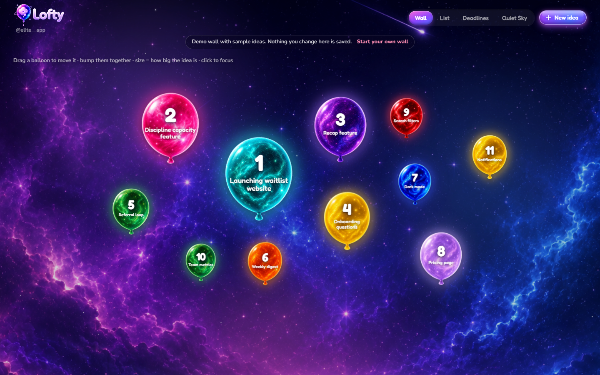

# Lofty, a galaxy of ideas

A personal idea tracker where every idea is a balloon. Capture them all in one
place, then work them in priority order, one at a time.

**[Try the live demo →](https://lofty-two.vercel.app/demo)**



- **Balloon size** is how big the idea is.
- **The number on it** is its priority.
- A balloon **deflates** as you make progress, and leaves the wall when the idea
  is finished.

## Built with Claude Code

I designed the product and directed the agents; the agents wrote the code. Every
commit in this repo was written by Claude Code agents working to my direction,
and the rules I gave them are in [`CLAUDE.md`](CLAUDE.md).

The balloon artwork was made for this app. The originals are in [`design/balloons/`](design/balloons).

## Routes

| Route        | Screen     | What it does |
|--------------|------------|--------------|
| `/wall`      | Wall       | Every active idea as a balloon in a physics field. Drag them, bump them together, click one to focus. |
| `/list`      | List       | The same ideas as rows, sortable by size or priority. |
| `/deadlines` | Deadlines  | Ideas sorted by soonest deadline. Opening one shows its countdown, a guided plan and a step checklist that drives the deflate. |
| `/new`       | New idea   | Name, size, balloon, priority and deadline, with a live preview. |
| `/archive`   | Quiet Sky  | Finished ideas with their notes, read-only. Restore or delete. |
| `/settings`  | Settings   | Opt-in link to the desktop wallpaper tool below. |
| `/demo`      | Demo       | Opens the wall with 11 sample ideas. Nothing is saved. |

`/` redirects to `/wall`.

## Data

Ideas are saved in the browser's `localStorage`. There is no backend, no
accounts and no sync between devices, so a first visit shows an empty wall
("Your galaxy is empty"). The demo keeps its sample ideas in memory and never
reads or writes saved data.

## Stack

Next.js 14 (App Router) · TypeScript · Tailwind CSS · matter-js for the wall's
physics. Deployed on Vercel. Desktop-first, with separate phone layouts below
720px.

There are no automated tests. Changes are checked with `lint`, `typecheck`, a
production build and by hand in the browser.

## Run locally

```bash
npm install
npm run dev
```

Then open <http://localhost:3000>.

```bash
npm run build      # production build
npm run start      # serve the build
npm run lint       # eslint
npm run typecheck  # tsc --noEmit
```

## Project layout

```
src/
├── app/            # one folder per route, plus layout and global styles
├── components/
│   ├── BalloonField.tsx    # the physics wall (matter-js)
│   ├── Balloon.tsx         # balloon image + number/name overlay, deflate
│   ├── IdeaBreakdown.tsx   # plan prompts + step checklist
│   ├── WallBackground.tsx  # animated nebula behind the wall
│   ├── Galaxy.tsx          # animated starfield behind the other screens
│   ├── AppShell.tsx        # navigation and page frame
│   ├── NewIdeaButton.tsx   # the animated "New idea" button
│   └── Stage.tsx           # scales fixed-size screens to the window
└── lib/
    ├── useIdeas.tsx        # the store: every read and write of ideas
    ├── types.ts            # the Idea model
    ├── balloons.ts         # the 50 balloons (id, name, image, glow colour)
    ├── format.ts           # size, date and deflate helpers
    ├── seed.ts             # the 11 demo ideas
    ├── useMediaQuery.ts    # phone/desktop switch
    └── wallSync.ts         # client for the wallpaper tool
design/             # source artwork for the balloons and logo
scripts/            # crop the source artwork into public/
tools/wallpaper-sync/   # optional desktop wallpaper tool (Windows)
```

## Desktop wallpaper (optional, Windows)

`tools/wallpaper-sync/` mirrors the wall onto a Windows desktop through
[Lively Wallpaper](https://www.rocksdanister.com/lively/). It is a small local
service on `127.0.0.1` that is off unless you install it and switch it on in
`/settings`. The web app works without it.

## License

Code is released under the [MIT License](LICENSE). The balloon, logo and
background artwork in `design/` and `public/` is not covered by it; all rights
to the artwork are reserved.
